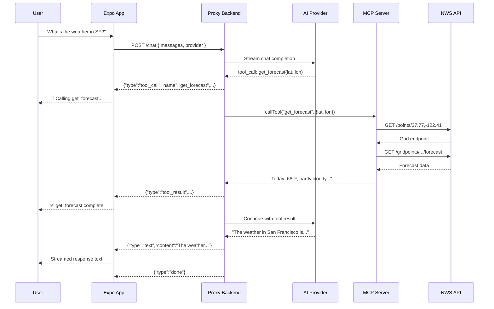

# Architecture

```mermaid
graph LR
    subgraph "Expo App (React Native)"
        A[Chat UI]
        B[NDJSON Stream Parser]
        C[Provider Toggle<br/>OpenAI / Anthropic]
    end

    subgraph "Proxy Backend (Node.js/Express :3001)"
        D[POST /chat]
        E[AI Adapter<br/>OpenAI \| Anthropic]
        F[Tool-Calling Loop]
        G[MCP Streamable HTTP Client]
    end

    subgraph "MCP Server (Python/FastMCP :8001)"
        H[get_alerts]
        I[get_forecast]
    end

    subgraph "External APIs"
        J[NWS Weather API]
        K[OpenAI API]
        L[Anthropic API]
    end

    A -->|"POST /chat (NDJSON)"| D
    D --> E
    E --> K
    E --> L
    E --> F
    F --> G
    G -->|"Streamable HTTP (JSON-RPC)"| H
    G -->|"Streamable HTTP (JSON-RPC)"| I
    H --> J
    I --> J
    D -->|"NDJSON stream"| B
    B --> A
```

## Data Flow



## Target Architecture v2 Checklist

This checklist hardens the v1 architecture without changing the core three-service topology.

### Goals

- Keep the same service boundaries (**client**, **backend**, **MCP server**)
- Improve provider reliability and portability
- Preserve tool-calling semantics across provider loops
- Improve UX when multiple tools are called in one turn

### Checklist (Reviewed + Implemented)

| # | Item | Why | Status |
|---|------|-----|--------|
| 1 | Provider key strategy supports one-or-many providers | Startup should not fail when only one provider is configured | ✅ Implemented |
| 2 | Preserve OpenAI assistant `tool_calls` in replayed conversation | Required for robust multi-step tool loops | ✅ Implemented |
| 3 | Make app backend URL configurable | Needed for device/emulator portability | ✅ Implemented |
| 4 | Support multiple tool status indicators in one assistant turn | Prevents overwriting when model emits several tool calls | ✅ Implemented |
| 5 | Align docs/config examples with code behavior | Avoids onboarding/runtime mismatch | ✅ Implemented |

## v2 Implementation Plan

### Phase 1 — Backend Reliability

1. Make provider API keys optional in config loading.
2. Validate selected provider key at request-time in `POST /chat`.
3. Return clear provider-specific error if key is missing.

### Phase 2 — Tool Loop Correctness

1. Extend backend chat message model with assistant tool-call metadata.
2. Persist assistant tool calls into conversation history before tool results.
3. Rehydrate OpenAI `assistant.tool_calls` when replaying messages.

### Phase 3 — Client Networking + UX

1. Add `EXPO_PUBLIC_BACKEND_URL` support in chat hook.
2. Provide platform defaults (Android emulator uses `10.0.2.2`).
3. Track and render multiple tool statuses per assistant message.

### Phase 4 — Documentation + DX

1. Add backend `.env.example`.
2. Update setup/config docs to reflect one-or-many provider key model.
3. Document frontend backend URL environment variable.
