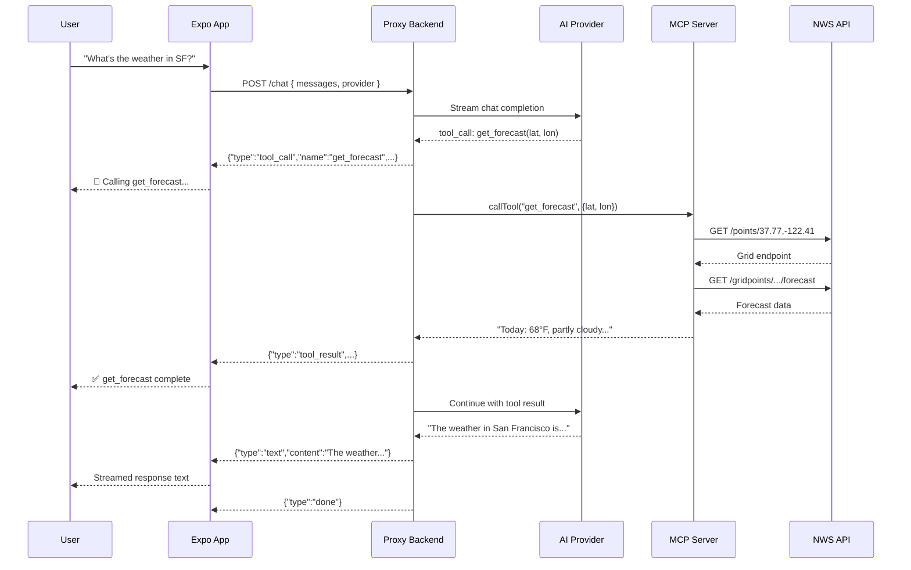

# Architecture

```mermaid
graph LR
    subgraph "Expo App (React Native)"
        A[Chat UI]
        B[NDJSON Stream Parser]
        C[Provider Toggle<br/>OpenAI / Anthropic]
    end

    subgraph "Proxy Backend (Node.js/Express :3001)"
        D[POST /chat]
        E[AI Adapter<br/>OpenAI \| Anthropic]
        F[Tool-Calling Loop]
        G[MCP Streamable HTTP Client]
    end

    subgraph "MCP Server (Python/FastMCP :8001)"
        H[get_alerts]
        I[get_forecast]
    end

    subgraph "External APIs"
        J[NWS Weather API]
        K[OpenAI API]
        L[Anthropic API]
    end

    A -->|"POST /chat (NDJSON)"| D
    D --> E
    E --> K
    E --> L
    E --> F
    F --> G
    G -->|"Streamable HTTP (JSON-RPC)"| H
    G -->|"Streamable HTTP (JSON-RPC)"| I
    H --> J
    I --> J
    D -->|"NDJSON stream"| B
    B --> A
```

## Data Flow


